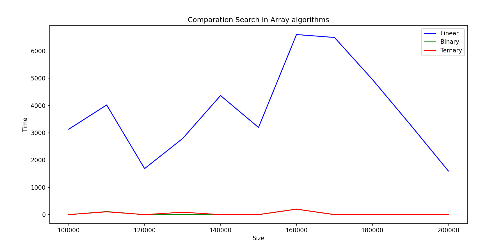
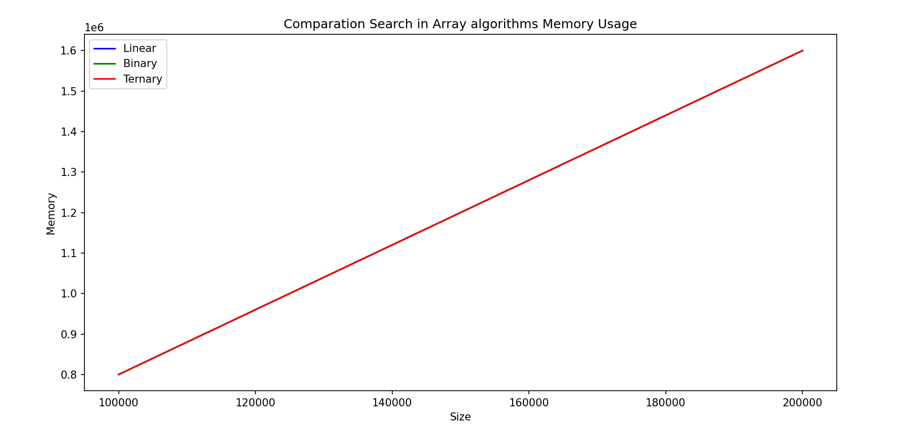
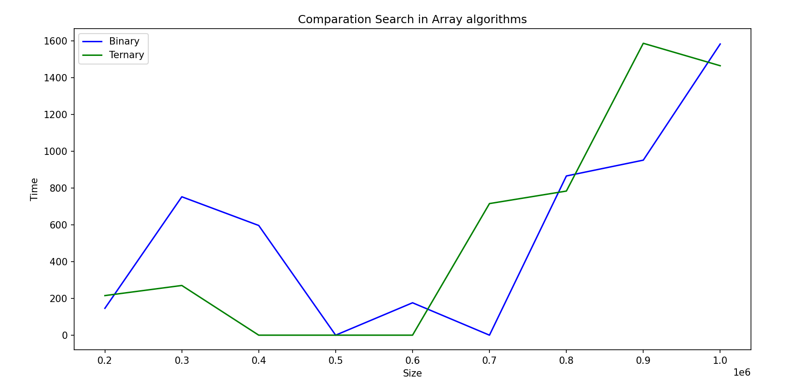
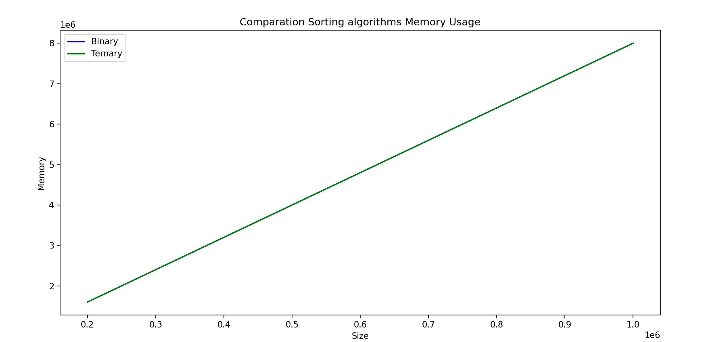

# About this repo

Simple python project to show a way to take experiental execution time to compare a set of algorithms (three in this case) in fair way.

## Search in sorted array

First even then odd sorting algorithms.

### Problem statement
​
The sample problem is to take a sorted list of integers, a number and find if that elements is in the list

### Time and Space complexity

| Algorithm       | Best Case       | Average Case     | Worst Case       | Space Complexity |
|---------------|---------------|----------------|----------------|----------------|
| **Linear Search** | \( O(1) \)       | \( O(n) \)        | \( O(n) \)        | \( O(1) \)        |
| **Binary Search** | \( O(1) \)       | \( O(log n) \)   | \( O(log n) \)   | \( O(1) \) (Iterative) / \( O(log n) \) (Recursive) |
| **Ternary Search** | \( O(1) \)       | \( O(log3 n) \) | \( O(log3 n) \) | \( O(1) \) (Iterative) / \( O(log n) \) (Recursive) |


# Python version
Python 3.11.0
​
# Running locally and testing

* Note: This instructions are for mac. Windows or linux may require some changes. 
* A good idea for this project, is to use a virtual environment, you could set up one with: [virtualenv](https://virtualenv.pypa.io/en/latest/).
* To create the virtual environment: `virtualenv env`
* To activate it:`source env/bin/activate`
* To install dependencies: `pip3 install -r requirements.txt`
* To run unit testing: `./test.sh`
* To try a default example, run: `: ./run.sh`. In the file ./run.sh is just an example, you can modify it. Theck the `app.py` file to get to understand how it works.

# Visualization

## Comparation Linear Search, Binary Search and Ternary Search

| Size   | Linear Search (Time, Memory) | Binary Search (Time, Memory) | Ternary Search (Time, Memory) |
|--------|-----------------------------------|-----------------------------------|-----------------------------------|
| 100000 | (3131, 800176)                   | (0, 800160)                      | (0, 800192)                      |
| 110000 | (4021, 880176)                   | (111, 880160)                    | (103, 880192)                    |
| 120000 | (1688, 960176)                   | (0, 960160)                      | (0, 960192)                      |
| 130000 | (2789, 1040176)                  | (0, 1040160)                     | (88, 1040192)                     |
| 140000 | (4366, 1120176)                  | (0, 1120160)                     | (0, 1120192)                      |
| 150000 | (3196, 1200176)                  | (0, 1200160)                     | (0, 1200192)                      |
| 160000 | (6603, 1280176)                  | (201, 1280160)                   | (201, 1280192)                    |
| 170000 | (6496, 1360176)                  | (0, 1360160)                     | (0, 1360192)                      |
| 180000 | (4954, 1440176)                  | (0, 1440160)                     | (0, 1440192)                      |
| 190000 | (3294, 1520176)                  | (0, 1520160)                     | (0, 1520192)                      |
| 200000 | (1599, 1600176)                  | (0, 1600160)                     | (0, 1600192)                      |






## Comparation Binary Search and Ternary Search

| Size   | Binary Search (Time, Memory) | Ternary Search (Time, Memory) |
|--------|-----------------------------------|-----------------------------------|
| 200000 | (146, 1600160)                   | (215, 1600192)                   |
| 300000 | (752, 2400160)                   | (270, 2400192)                   |
| 400000 | (596, 3200160)                   | (0, 3200192)                     |
| 500000 | (0, 4000160)                     | (0, 4000192)                     |
| 600000 | (176, 4800160)                   | (0, 4800192)                     |
| 700000 | (0, 5600160)                     | (715, 5600192)                   |
| 800000 | (865, 6400160)                   | (783, 6400192)                   |
| 900000 | (951, 7200160)                   | (1586, 7200192)                  |
| 1000000| (1582, 8000160)                  | (1464, 8000192)                  |






# Current coverage

Make sure you have "coverage" in your requirements.txt file and run pip install. Then run `coverage run -m unittest discover` and after that run `coverage report` to get the following table:

```
Name                            Stmts   Miss  Cover
---------------------------------------------------
arraysearch\__init__.py             0      0   100%
arraysearch\algorithms.py          34      0   100%
arraysearch\constants.py            3      0   100%
arraysearch\data_generator.py      11      1    91%
test\__init__.py                    0      0   100%
test\test_algorithms.py            24      1    96%
test\test_data_generator.py        29      1    97%
---------------------------------------------------
TOTAL                             101      3    97%
```

# Code beautifier
This code has been beautify using black: https://github.com/psf/black. 
The command to use is `black . -l 120`.
